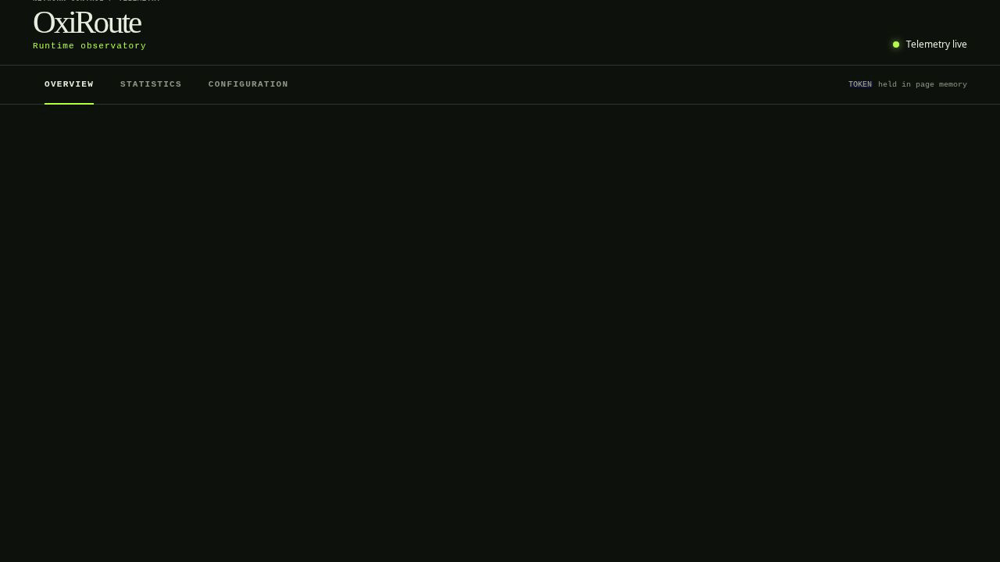
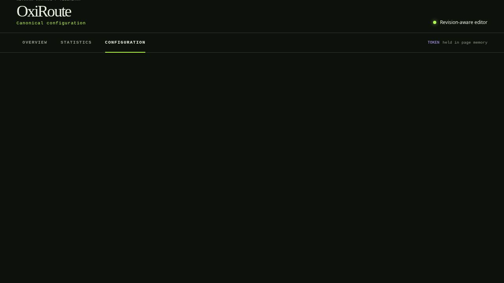

# Dashboard Guide

The management UI is a build-time Vue 3 application with Pug templates. It is served from the
configured `management.ui_dir`; it is not a separate remote SaaS console.



The GIF is a deterministic product walkthrough rendered by Remotion. It uses representative data,
not a production daemon or secret-bearing screenshot.

## View Map

| View | What it answers | Data source |
| --- | --- | --- |
| **Overview** | Is the process, listener, origin pool, topology, or RTMP catalog healthy? | Monitoring, topology, and RTMP catalog snapshots |
| **Statistics** | What are the process, listener, backend, queue, and server counters? | The active runtime monitoring snapshot |
| **Operations** | What can be drained, reloaded, rolled back, or changed administratively? | Authenticated generation and runtime action APIs |
| **Certificates** | Which imported, Certbot, or managed identities are active and what lifecycle actions are available? | Authenticated TLS inventory and job APIs |
| **Events** | What bounded operational events are available now? | The non-durable event ring and SSE delivery |
| **Audit** | What redacted control operations were durably retained? | Authenticated durable audit history and status |
| **Configuration** | What is on disk, what is active, and what would a typed draft render as? | Authenticated config API and candidate validation |
| **Provenance** | Which native reports, blockers, requirements, and canonical fields were retained? | Authenticated redacted import-report API |

## Overview

The overview has four reading levels:

1. The header state says whether telemetry is live, synchronizing, stale, or offline.
2. The readout bar shows active connections, total traffic, host memory, and uptime.
3. The monitoring panels show aggregate traffic, host pressure, process resources, and RTMP activity.
4. Listener rows, upstream pools, topology, and active stream cards expose the entity-level evidence.

When a refresh fails, the UI retains the last valid monitoring sample and labels it stale. It does
not replace a failed sample with fabricated zeroes. An endpoint in `unknown` state is not treated as
healthy; health-enabled pools begin unavailable until their checks establish eligibility.

## Topology Inspector

Select a node in the topology schematic to inspect:

- stable ID and canonical config path;
- redacted configuration attributes;
- runtime state and active connection overlays;
- the typed relation to listeners, services, routes, pools, and endpoints.

Certificate private-key paths, recording roots, token paths, and other sensitive paths are excluded
or redacted. The topology endpoint is an active-generation view; configuration validation exposes a
separate candidate topology marked `not_active`.

## Statistics

Statistics is intentionally dense. On a narrow screen, use the horizontal table scroll or move back
to Overview for summary cards. Counters with potentially large `u64` values arrive as decimal strings
so JavaScript does not lose precision. Current gauges and bounded configuration counts remain JSON
numbers.

The table distinguishes:

- runtime state from administrative state;
- observed health from an operator health override;
- configured connection capacity from a runtime override;
- successful and failed checks from consecutive transition streaks;
- active queue depth from cumulative queue totals.

## Configuration Workspace



The workspace deliberately follows a review flow:

```text
unlock -> load disk revision -> edit typed fields -> server validate -> inspect preview/topology -> save
```

Important states:

- **Disk revision:** the exact authored root bytes used as the save precondition.
- **Active revision:** the effective generation currently serving traffic.
- **Candidate revision:** the fully prepared draft, which may not be active yet.
- **Compositional root:** a KDL/HOCON/UCI source that uses templates or native references; it is
  inspectable and validatable but typed save is disabled so source declarations are not flattened.
- **Stale draft:** the file changed outside the UI; the UI preserves the draft and requires an
  explicit discard/reload decision.

The preview is rendered by the backend in the root's authored format. The browser does not generate
Lua, KDL, HOCON, or UCI source itself.

For a `weighted_round_robin` pool, the configuration workspace exposes one bounded integer weight
per server and keeps the weight list aligned when servers are added or removed. Native source files
remain read-only.

## Audit And Provenance

The Audit view reads the separate durable redacted control-history store. It supports category/result
filters, cursor pagination, persistence status, and degraded-store warnings. It never substitutes the
non-durable Events view when the durable route is unavailable.

The Provenance view reads retained native import reports through the authenticated API. It shows
redacted source graphs, blockers, requirements, diagnostics, canonical field origins, and finalized
read-only KDL previews. It does not rewrite native files or activate standalone reports.

## RTMP Controls

Active stream cards show publisher identity, audience, codec observations, media totals, relay state,
and recorder phases. Manual recorder buttons are available only when:

- a publisher is currently attached;
- the active configuration contains a manual recorder;
- the observed media is a supported legacy AVC/AAC FLV combination; and
- no conflicting start/stop transition is already running.

Continuous recorders remain observable but are not manually toggled. Recorder names shown in the UI
are relative names; the configured recording root is never sent to the browser.

## Access And Accessibility

The management token is entered into the page and held in memory. It is not stored in cookies,
localStorage, the URL, or the generated dashboard GIFs. The UI uses labeled controls, keyboard-focus
states, non-color status labels, responsive detail panels, and explicit loading/stale/error states.

For the exact route and authentication contract, read [API_UI_SPEC.md](../API_UI_SPEC.md).
